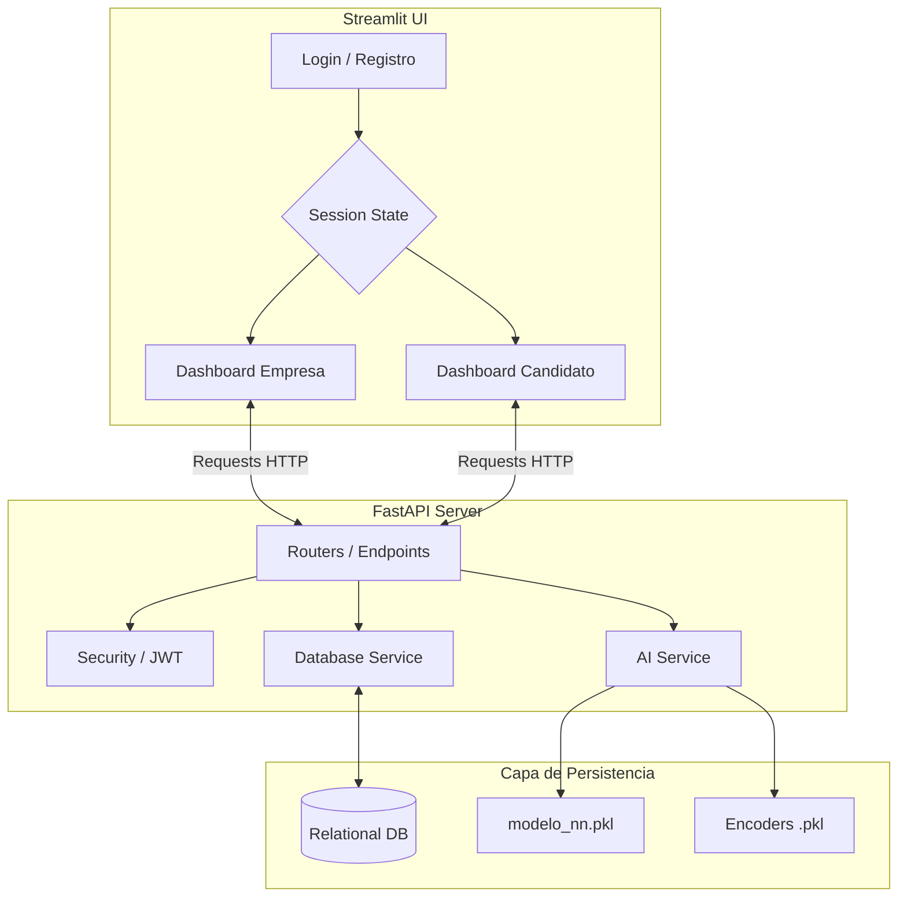

# 📄 B2B-Logic_IA: Sistema de Filtrado Inteligente de Perfiles en el Área de Desarrollo de Software

**B2B-Logic AI** es una solución integral basada en Inteligencia Artificial diseñada para evaluar características profesionales. Mediante el uso de una red neuronal profunda (`MLPClassifier`) y una arquitectura web interactiva, permitimos a los departamentos de reclutamiento predecir la compatibilidad del talento de forma instantánea, eliminando sesgos cognitivos y tomando decisiones de contratación justas y basadas en datos.

---

## 🔗 Enlaces del Proyecto
| Recurso                      | Enlace                                                                                   |
|------------------------------|------------------------------------------------------------------------------------------|
| **Sistema en Producción**    |                                                                                          |
| **Demo en Video**            |                                                                                          |
| **Informe Técnico**          |                                                                                          |

---

## 👥 Equipo de Desarrollo
Proyecto desarrollado como parte de las actividades académicas en la **Escuela Politécnica Nacional (EPN)**.
* **Simbaña Kevin**
* **Paillacho Andrew**

---

## 🚀 Características y Capacidades del Sistema

El sistema cuenta con una arquitectura moderna B2B dividida en Frontend (Streamlit) y Backend (FastAPI + SQLite/PostgreSQL), ofreciendo las siguientes funcionalidades clave para automatizar la evaluación de candidatos:

### 1. 🔐 Autenticación Segura (JWT)
* **Login y Registro:** Rutas protegidas mediante tokens JWT generados de forma segura en `security.py`.
* **Roles Definidos:** Acceso segregado estricto entre vistas de `Empresa` y `Candidato`.
* **Criptografía:** Almacenamiento seguro de contraseñas utilizando hashing.

### 2. 📊 Dashboards Interactivos (B2B y Candidatos)
* **Vista Empresas (`dashboard_empresa.py`):** Panel gerencial para publicar vacantes, monitorear el pool de postulantes y visualizar el porcentaje de compatibilidad sugerido por el modelo predictivo.
* **Vista Candidatos (`dashboard_candidato.py`):** Panel para la auto-gestión del perfil técnico, años de experiencia y modalidad laboral (Remoto/Presencial/Híbrido).
* **Gestión de Estado (UX):** Implementación avanzada del `Session State` de Streamlit en `utils/data.py` para retener de forma fluida el token de autorización y evitar re-autenticaciones.

### 3. 🔮 Motor de Inteligencia Artificial (AI Core)
* **Red Neuronal (MLP):** Cruce inteligente de las *features* del candidato frente a las restricciones de la vacante.
* **Procesamiento de Lenguaje y Encoding:** Las entradas de texto son mapeadas numéricamente usando `lista_categorias.pkl`, mientras que `columnas_datos.pkl` asegura que el tensor de entrada (input shape) sea exactamente el que la red neuronal espera.
* **Inferencia en Tiempo Real:** El microservicio `ai_service.py` lee el modelo empaquetado (`modelo_nn.pkl`) y responde en milisegundos a través de la API REST.

### 4. 📈 Entorno de Data Science (MLOps)
* **ETL Pipeline:** Limpieza robusta de datos provenientes del dataset original *India Job Market 2024-2026*.
* **Auditoría del Modelo:** Transparencia técnica respaldada por `last_metrics.json` (que documenta Accuracy, F1-Score, etc.) y `confusion_matrix.png` para monitorear el equilibrio entre falsos positivos y negativos.
* **Reentrenamiento:** Arquitectura preparada con `training_service.py` para habilitar futuros ciclos de reentrenamiento desde la API.

---

## 🛠️ Stack Tecnológico Detallado

| Capa | Tecnologías Clave | Propósito |
| :--- | :--- | :--- |
| **Backend** | Python 3.10+, FastAPI, Pydantic | API REST asíncrona, validación estricta de esquemas de datos. |
| **Frontend** | Streamlit, Pandas | Interfaces de usuario reactivas, análisis y visualización de datos. |
| **Base de Datos** | SQLAlchemy (ORM), SQLite | Persistencia relacional de usuarios, perfiles de candidatos y vacantes. |
| **Motor IA** | Scikit-Learn (MLPClassifier), Joblib | Entrenamiento y serialización del algoritmo predictivo de compatibilidad. |

---

## 🏗️ Arquitectura Técnica y Flujo de Datos

El diseño del sistema aplica un estricto patrón de separación de responsabilidades (Frontend desacoplado del Backend):



### Estructura de Directorios Clave
Para una fácil navegación y mantenimiento por parte de futuros desarrolladores:
* **`/api/app/`**: Contiene el núcleo backend (`main.py`, `schemas.py`) y sus dependencias de acceso a datos (`models`, `data`).
* **`/api/ai_model/`**: Almacena los pesos binarios de la red neuronal pre-entrenada (`.pkl`) y sus procesadores vectoriales en `/tranformation/`.
* **`/frontend/pages/`**: Alberga las interfaces gráficas que consume el usuario final.
* **`/ia_training/`**: Entorno puro de Data Science (Jupyter Notebook `B2B_Clean_Data.ipynb` y archivos `.csv` crudos y procesados).

---

## 🌿 Gestión de Ramas y Control de Versiones

Durante el ciclo de vida del desarrollo, se aplicó una estrategia de ramas que permitió una integración fluida:

1. **`backend`**: Rama enfocada a la infraestructura de datos, endpoints RESTful y la carga del modelo de machine learning.
2. **`frontend`**: Rama dedicada a consumir la API y construir la experiencia del usuario final.
3. **`main`**: Rama maestra de producción. **Actualmente, ambas ramas funcionales (`backend` y `frontend`) se encuentran exitosamente fusionadas y estables en esta rama principal.**

---

## ⚙️ Guía de Despliegue y Ejecución Local

Para levantar el ecosistema completo en un entorno local de desarrollo, sigue exactamente estos pasos:

### 1. Clonar el repositorio
```bash
git clone https://github.com/KevinSimbana04/CV-Logic_IA.git
cd CV-Logic_IA
```

### 2. Configurar y Levantar el Backend (FastAPI)
```bash
# Ingresar a la carpeta de la API
cd api

# Instalar dependencias del servidor
pip install -r app/requirements.txt

# (Opcional) Inicializar las tablas de la base de datos (usando script interno si es necesario)
python app/data/reset_db.py

# Levantar el servidor en puerto 8000
uvicorn app.main:app --reload
```
> 💡 **Tip de Desarrollo:** Una vez corriendo, puedes probar interactivamente los endpoints accediendo a la documentación de Swagger UI en `http://localhost:8000/docs`.

### 3. Levantar el Frontend (Streamlit)
Abre una **nueva pestaña o ventana de terminal** (asegurándote de mantener el backend ejecutándose en la anterior), y ejecuta:
```bash
# Regresar a la raíz y entrar al frontend
cd frontend

# Instalar dependencias gráficas
pip install -r requirements.txt

# Levantar la interfaz de Streamlit
streamlit run app.py
```
> 💡 **Resultado:** El panel se abrirá automáticamente en tu navegador por defecto apuntando a `http://localhost:8501`. 

---

© 2026 - B2B-Logic IA | Plataforma Inteligente B2B de Reclutamiento. 
Proyecto académico de la Escuela Politécnica Nacional (EPN).

